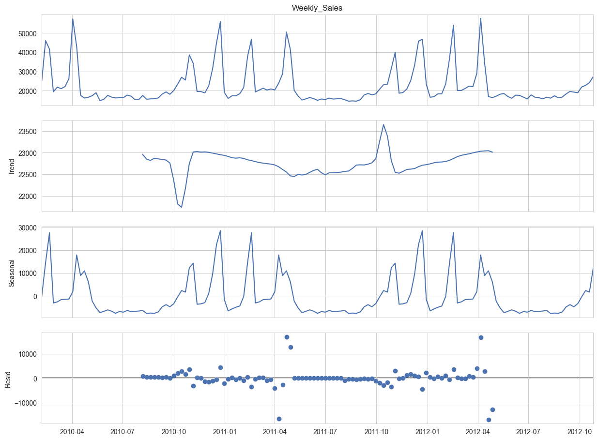
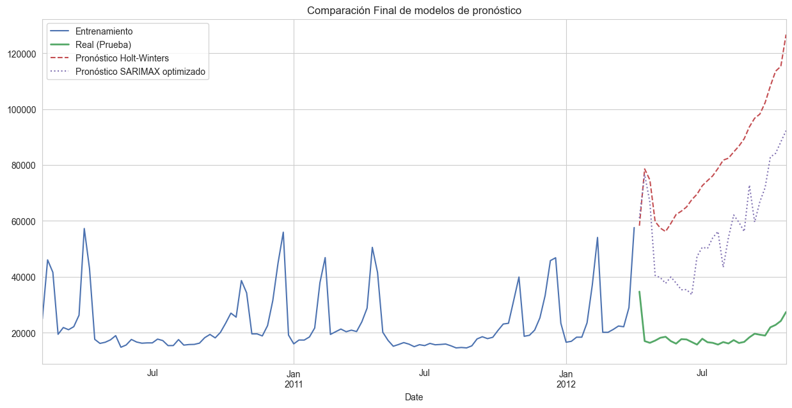

# Pronóstico de Ventas Semanales para Tiendas Walmart

## 📜 Resumen del Proyecto

Este proyecto presenta un análisis de series temporales y un modelo de pronóstico para predecir las ventas semanales a nivel de departamento para Walmart. Utilizando un dataset público de Kaggle, el análisis explora patrones de ventas, identifica el impacto de los días festivos y variables económicas, y culmina en la construcción y optimización de modelos predictivos.

El objetivo es demostrar un flujo de trabajo completo de análisis de datos, desde la limpieza y la ingeniería de características hasta el modelado y la evaluación crítica de los resultados, simulando un problema de negocio real y de alto impacto como es la previsión de la demanda en el sector retail.

---

## 🎯 Objetivos del Análisis

*   Analizar los componentes de la serie temporal de ventas (tendencia y estacionalidad) para una tienda y departamento específicos.
*   Cuantificar el impacto de los días festivos en las ventas semanales.
*   Construir un modelo de pronóstico base (Holt-Winters) y un modelo avanzado (SARIMAX) que incorpore variables externas.
*   Optimizar el modelo avanzado a través de ingeniería de características y búsqueda de parámetros.
*   Evaluar y comparar el rendimiento de los modelos para proponer una solución y discutir sus limitaciones.

---

## 🛠️ Herramientas y Librerías Utilizadas

*   **Lenguaje:** Python
*   **Librerías Principales:**
    *   **Pandas:** Para la manipulación y limpieza de datos.
    *   **NumPy:** Para operaciones numéricas.
    *   **Matplotlib & Seaborn:** Para la visualización de datos.
    *   **Statsmodels:** Para el modelado de series temporales (descomposición, Holt-Winters, SARIMAX).
    *   **Scikit-learn:** Para las métricas de evaluación de modelos.
*   **Entorno:** Jupyter Notebook, VS Code

---

## 📈 Proceso y Hallazgos Clave

El análisis se centró en la **Tienda 1, Departamento 1** como caso de estudio representativo.

### 1. Análisis Exploratorio de Datos (EDA)
El EDA reveló una **fuerte estacionalidad anual** en las ventas, con picos pronunciados y predecibles durante la temporada navideña y otros festivos clave como el Super Bowl. La tendencia general de las ventas se mostró relativamente estable a lo largo del periodo de estudio.

### 2. Modelado y Optimización
Se implementaron y compararon tres modelos de pronóstico:

*   **Modelo Base (Holt-Winters):** Capturó la estacionalidad general pero con un error considerable, al no tener en cuenta factores externos.
*   **Modelo SARIMAX Optimizado:** Se refinó el modelo SARIMAX a través de **ingeniería de características** (creando variables `dummy` para cada festivo específico) y una búsqueda de parámetros (Grid Search) para encontrar los órdenes `(p,d,q)` óptimos.

### 3. Resultados
El modelo **SARIMAX optimizado** demostró ser el más preciso. La inclusión de variables externas y la optimización de parámetros lograron una **reducción del error (RMSE) del 36%** en comparación con el modelo base.

| Modelo                      | RMSE (Error Promedio) |
| :-------------------------- | :-------------------- |
| Holt-Winters (Base)         | $64,912.64            |
| SARIMAX Optimizado          | $41,233.59            |

---

## 📄 Conclusiones y Limitaciones

Aunque el modelo optimizado representó una mejora significativa, un RMSE de ~$41k indica que aún existen complejidades en los datos que no fueron capturadas, como relaciones no lineales y el impacto combinado de múltiples factores.

**Conclusión Principal:** Los factores externos como los festivos y las promociones son predictores cruciales para las ventas. Un modelo que los ignore (como Holt-Winters) será inherentemente limitado.

**Próximos Pasos (Recomendaciones para un Proyecto Futuro):**
1.  **Implementar Modelos de Machine Learning:** Utilizar algoritmos como XGBoost o LightGBM para capturar automáticamente relaciones no lineales e interacciones entre variables.
2.  **Ingeniería de Características Avanzada:** Crear variables de retraso y medias móviles para que el modelo tenga en cuenta el comportamiento reciente de las ventas.

---

## 🚀 Cómo Explorar este Repositorio

*   **/[forecast_walmart_store_sales].ipynb**: Contiene el código completo del análisis, desde la limpieza de datos hasta la evaluación final de los modelos.
*   **/data/**: Carpeta con los archivos `.csv` originales del dataset.
*   **/images/**: Carpeta con las imágenes y gráficos obtenidos en este proyecto.

